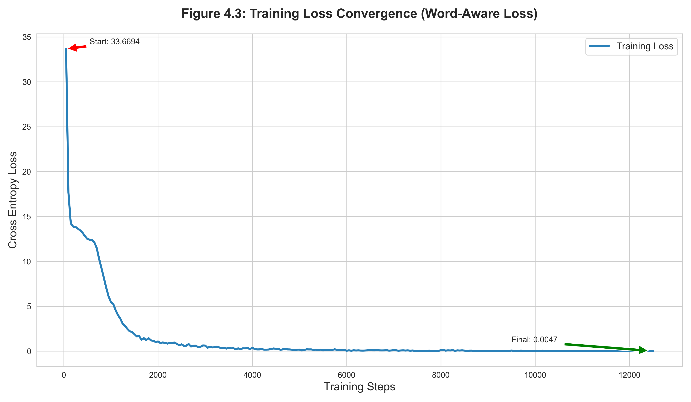

# tigrinya-trocr-research

# TigrinyaTrOCR: Adapting TrOCR for Tigrinya: Transfer Learning Strategies for Low-Resource Optical Character Recognition of Ge'ez Script 

[](https://pytorch.org/)
[](LICENSE)
[](outputs/fast_model)
[-76b900.svg)](https://www.nvidia.com/)

> **Master's Thesis Project**  
> **Author:** Yonatan Haile Medhanie  
> **Institution:** Nankai University, College of Software  
> **Task:** Optical Character Recognition (OCR) for Low-Resource Languages

---

##  Abstract

**TigrinyaTrOCR** is a fine-tuned Transformer-based OCR model designed for the **Tigrinya language** (Ge'ez script). It utilizes the **Microsoft TrOCR** architecture (Vision Transformer Encoder + GPT-2 Decoder) to achieve state-of-the-art results on printed Tigrinya text.

By fine-tuning [`microsoft/trocr-base-handwritten`](https://huggingface.co/microsoft/trocr-base-handwritten) on 10,000 training samples from the GLOCR dataset, this model achieves **0.20% CER** and **97.44% exact match accuracy** on a held-out test set of 5,000 samples.

###  Key Features

*   **Transfer Learning:** Fine-tuned from a pre-trained handwritten TrOCR model, adapted for printed Tigrinya text.
*   **Hardware Optimized:** Optimized for **NVIDIA RTX 50-series (Blackwell)** GPUs using Gradient Accumulation (Effective Batch Size 8) and Mixed Precision (FP16).
*   **Interactive Demo:** Includes a Flask-based Web Interface for batch processing and real-time validation.
*   **Extended Vocabulary:** Support for 231+ Ge'ez characters including labialized forms and punctuation.

---

##  Benchmark Results

Evaluation was conducted on the full **Tigrinya Test Set (N=5,000)**.

| Metric | Value |
| :--- | :---: |
| **Character Error Rate (CER)** | **0.20%** |
| **Word Error Rate (WER)** | **0.77%** |
| **Exact Match Accuracy** | **97.44%** |
| **Perfect Transcriptions** | **4,872 / 5,000** |

> *Of the 5,000 test samples, 4,872 (97.44%) were transcribed perfectly. The remaining 128 samples (2.56%) contained at least one character-level error. The most frequent failures involve numerals and mixed-script text, accounting for 55 of the 128 error samples.*


*(Figure: Training convergence over 12,500 steps)*

---

##  Installation

**Prerequisites:** Python 3.10+ and an NVIDIA GPU (CUDA 12.x required).

### 1. Clone Repository

```bash
git clone https://github.com/YoHa2024NKU/tigrinya-trocr-research.git
cd tigrinya-trocr-research
```

### 2. Install PyTorch (Critical)

**Note:** For **RTX 5060 / 50-series** GPUs, you must use PyTorch Nightly (CUDA 12.8) as Stable versions are incompatible with the Blackwell architecture.

```bash
# Windows / Linux
pip install --pre torch torchvision torchaudio --index-url https://download.pytorch.org/whl/nightly/cu124
```

### 3. Install Dependencies

```bash
pip install -r requirements.txt
```

---

##  Usage

### 1. Training

Run the training pipeline. This uses **Batch Size 2** with **Gradient Accumulation 4** to fit on 8GB VRAM while mathematically simulating Batch Size 8.

```bash
python train.py
```

*   **Output:** Model weights saved to `outputs/fast_model/`.
*   **Time:** Approx. 2h 20m on RTX 5060.

### 2. Evaluation

Generate CER, WER, and Accuracy metrics on the test set.

```bash
python predict.py
```

### 3. Visualization

Generate training loss curves and error distribution charts for the thesis.

```bash
python visualize.py
```

### 4. Web Interface (Demo)

Launch the local web app to test images. Features **Batch Upload** and **Green/Red Validation**.

```bash
python app.py
```

*   Open your browser at: `http://localhost:5000`

---

## Project Structure

```text
TigrinyaTrOCR/
TigrinyaTrOCR/
├── config/             # Hyperparameter configurations (YAML)
├── data/               # Dataset (Train/Test/Dev TSV files)
├── outputs/            # Trained model checkpoints
├── src/                # Source Code
│   ├── data.py         # Dataset loading & Robust error handling
│   ├── model.py        # Tokenizer extension & Architecture
│   ├── trainer.py      # Optimized Trainer Logic
│   └── utils.py        # Logging & Seeding
├── app.py              # Flask Web Application
├── train.py            # Main Training Entry Point
├── evaluate.py         # Testing & Metrics Calculation
├── visualize.py        # Graph Generation
└── requirements.txt    # Dependency List
```

---

## Citation

If you use this code or methodology, please cite:

```bibtex
@mastersthesis{Medhanie2026TigrinyaTrOCR,
  author  = {Yonatan Haile Medhanie},
  title   = {Adapting TrOCR for Tigrinya: Transfer Learning Strategies for Low-Resource Optical Character Recognition of Ge'ez Script},
  school  = {Nankai University},
  year    = {2026},
  address = {Tianjin, China}
}
```

##  Acknowledgements

*   **Ministry of Commerce (MOFCOM), PRC:** For scholarship support.
*   **Nankai University:** For academic supervision and resources.
*   **Hugging Face:** For the Transformers library.